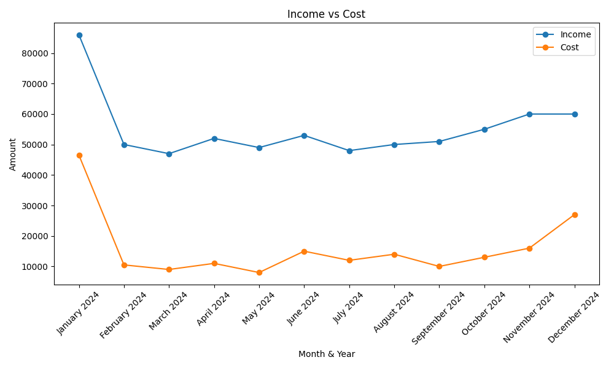
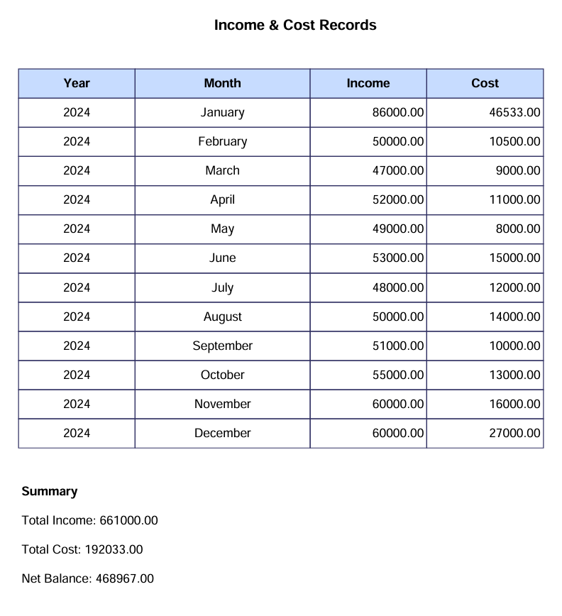

# Income & Cost Tracker

This is an Income and Cost Tracker Python program that allows you to track and visualize your income and cost records over time. The program stores data in a JSON file and provides various functionalities like adding records, viewing records, analyzing the data, visualizing it using graphs, and exporting data to PDF.

## Features

- **Add Record**: Input your income and cost for a specific year and month.
- **View Records**: View the records in a tabular format.
- **Visualize Data**: Generate a graph comparing income and costs over time.
- **Analyze Data**: Find trends such as the highest income month, the year with the highest cost, and overall net balances.
- **Query Balance**: Check the current balance or the balance for a specific year and month.
- **Export to PDF**: Export the records and a summary of income, cost, and balance to a PDF file.

## Installation

To run this program, you need to install the required libraries. You can install them using `pip`:

```bash
pip install matplotlib tabulate fpdf
````

# How to Use
## Run the Program:
Start the program by running the main.py file.

```python
python main.py
```
## Choose an Option:
The program will present a menu with the following options:

- Add a record for a specific year and month
- View all income and cost records
- Export the records to a PDF
- Visualize the income and cost data using a graph
- Analyze the data (e.g., highest income, highest cost year)
- Query the balance (current balance or specific year/month balance)
- Exit the program
**Add Record:** To add a record, you will need to provide the year, month, income, and cost for that period. The program prevents entering future dates.

**View Records:** The program will display all records stored in the JSON file.

**Visualize Data:** The program will generate a line graph comparing income and cost data over time.

**Analyze Data:** The program will display insights like the highest income month, year with the highest cost, and net balances for each year.

**Export to PDF:** The program generates a PDF that includes all records and a summary of income, cost, and balance.

**File Format:** The program stores records in a JSON file named income_cost.json. Each record consists of the following fields:

```json
{
  "year": 2024,
  "month": "January",
  "income": 5000.00,
  "cost": 2000.00
}
```
# Example Output
## 1. Sample Table:
```bash
+------+-----------+--------+-------+
| Year |   Month   | Income | Cost  |
+------+-----------+--------+-------+
| 2024 | January   | 5000.00| 2000.00|
| 2024 | February  | 6000.00| 2500.00|
+------+-----------+--------+-------+
```
## 2. Sample Graph:
The program will display a graph with Income and Cost plotted over time (Month & Year).


## 3. Exported PDF Example:
The PDF will contain the following sections:


- Table: A list of all the records.
- Summary: Total income, total cost, and net balance.
# License
This project is open-source and available under the MIT License.

# Contributing
Feel free to fork this repository and contribute to improvements. If you have any suggestions or bug fixes, please open an issue or submit a pull request.

# Author
This project is developed by PROTIK DAS UTSO. You can reach me at [protikdas018830@gmail.com] or [+8801883044415].

